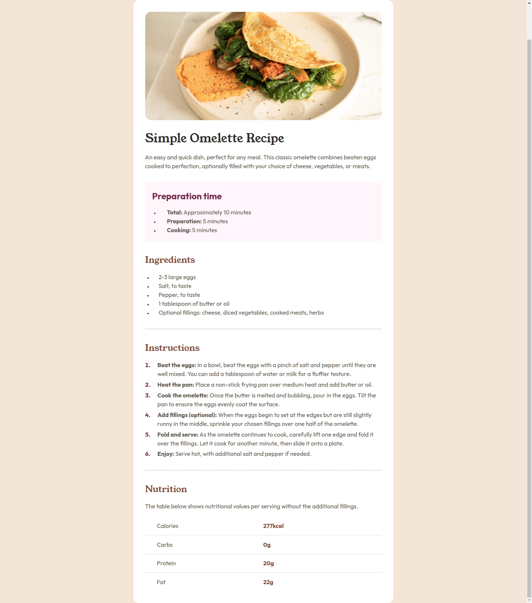

# Frontend Mentor - Recipe page solution

This is a solution to the [Recipe page challenge on Frontend Mentor](https://www.frontendmentor.io/challenges/recipe-page-KiTsR8QQKm). Frontend Mentor challenges help you improve your coding skills by building realistic projects. 

## Table of contents

- [Overview](#overview)
  - [Screenshot](#screenshot)
  - [Links](#links)
- [My process](#my-process)
  - [Built with](#built-with)
  - [What I learned](#what-i-learned)
  - [Continued development](#continued-development)
- [Author](#author)

## Overview

### Screenshot

### Links

- Solution URL: [code](https://github.com/anderjackie/recipe-page)
- Live Site URL: [live site](https://htmlpreview.github.io/?https://github.com/anderjackie/recipe-page/blob/main/index.html)

## My process

### Built with

- Semantic HTML5 markup
- CSS custom properties
- Flexbox
- Mobile-first workflow

### What I learned

The importance of mobile first. It's way easier :)

### Continued development

Looking forward for the use of media queries and grids.

## Author

- Website - [mysmallcornerofinternet](http://mysmallcornerofinternet.life/)
- Frontend Mentor - [@anderjackie](https://www.frontendmentor.io/profile/anderjackie)
